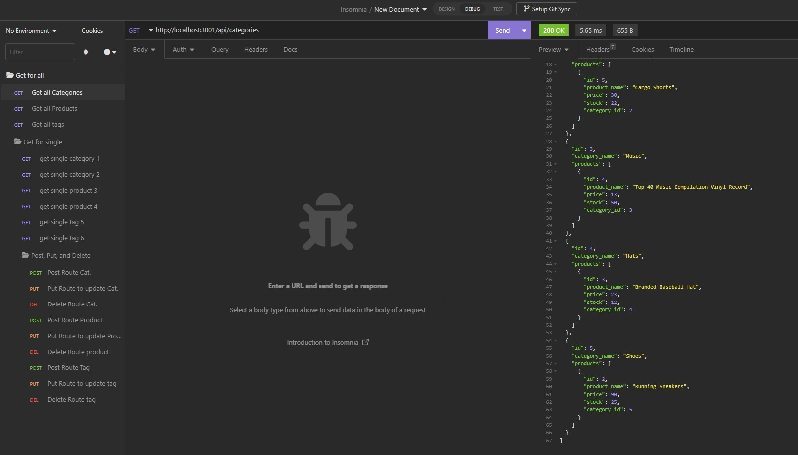
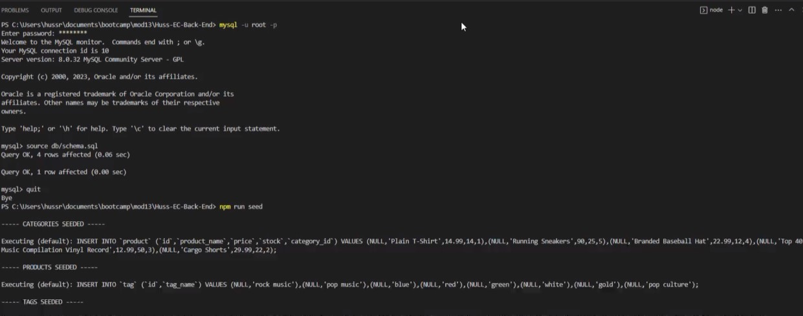

# Huss-EC-Back-End

 ## Table of Contents: 
* [Description](#Description)
* [Actions Taken](#Actionstaken)
* [Screen Shot](#Screenshot)
* [Links](#Links)

## Description
To build the back end of an E-Commerce site with Express.JS, MySQL, and Sequelize that allows the manager of an internet retail company to easily view, manage, and interact with information stored in a database. The Manger will be able to add, delete, update and view the information stored on the inventory database.    

## Actions Taken 
* Utilized MySQL to connect to the database using Sequelize.  
* Sourced schema and seed commands to create the database with the test data. 
* Completed code for the models and API routes. 
* Utilized insomnia to test the routes and ensure they're behaving as expected.  

## Screen Shot

 

 
 
## Links

Video Link: https://drive.google.com/file/d/1ixJhb3FBYQtyzf3sWSNROrMK-LHd4qyO/view

Github Link: https://github.com/hussrizk56/Huss-EC-Back-End
